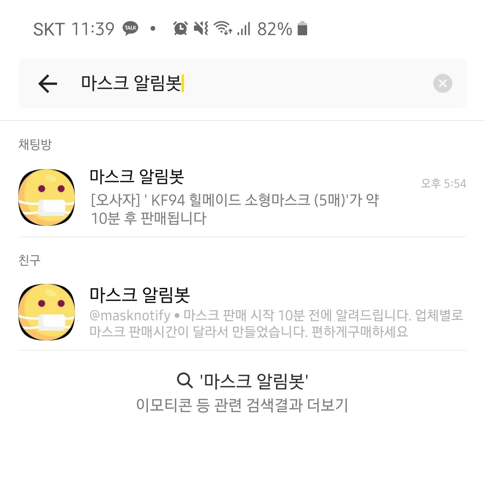

# maskbot

카카오톡 마스크 판매 알림 챗봇

coronamask.kr를 참고하여 마스크가 판매되기 10분 전에 알려줍니다.

  
❗ ⚠ 2020.07.현재 마스크봇 서비스를 중단했습니다. 직접 서버에 돌려서 사용하세요

    
## 이용방법

마스크봇 채널 링크로 접속

채널 홈 : https://pf.kakao.com/_xgWysxb

혹은

카카오톡에서 마스크봇을 검색해서 친구추가

현재는 검색을 막아뒀습니다. 돈이 많이 들어서...ㅜㅜ
    

    
    
## 개발환경

언어 : Python3

OS : Window(로컬) / Linux Ubuntu 18.04(호스팅)

호스팅 : vultr

반복작업 : crontab
    
    
## 커스텀 방법

`data/login_info.json'에 자신의 id/pw로 수정합니다.

    
## 업데이트 내역

- 2020.03.09.
  - 알림을 보낼때 로그인하는 간격이 짧은 오류 수정
  
- 2020.03.10.
  - 내일 판매되는 마스크까지 알리는 오류 수정
  - `http://`로 시작하는 주소의 경우 링크가 제대로 보내지지 않는 오류 수정

- 2020.03.23.
  - 텔레그램 봇 추가
  - 텔레그램 봇 링크 : https://t.me/joinchat/AAAAAEet7BOQSNRwtWUdwQ

## 정보

봇 제작자 : blackmilk274@gmail.com

개발을 허용해주신 coronamask.kr 개발자님 감사합니다.

